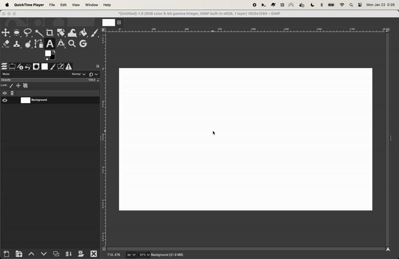

# GIMP Text Outline Plugin

## Description

This [Python-based](https://www.gimp.org/docs/python/pygimp.html) [GIMP](https://www.gimp.org/) plugin outlines a Text Layer using the active Brush, and allows the result
to be more easily managed managed and re-outlined via a Layer Group.

Outlining text in GIMP is a bit of a pain. You have to do several manual steps to get a nice looking outline around you text.

Furthermore, you either have to rasterize the Layer for the outline, which makes the text unmodifiable.
Or, you have to manage a second outline Text Layer, and redo the whole process if you want to make any adjustments to the text.

This plugin automates all of that via a Filter, and makes it easy to re-outline the Text Layer after you make changes.

## Installation

Installing Python-based GIMP plugins is pretty simple. This is especially true for plugins like this one where it is just a single file.

In short, all you need to do is let GIMP know about the location of the Python file, and it will load it for you.

You can do this in one of two ways.

### Method 1: Copy the file to your GIMP plugins directory

Copy the `managed-text-outline.py` file to your GIMP plugins directory.

- On Linux, this is usually `~/.config/GIMP/[version]/plug-ins/`
- On macOS, this is usually `~/Library/Application\ Support/GIMP/[version]/plug-ins/`
- On Windows, this is usually `C:\Users\<username>\AppData\Roaming\GIMP\[version]\plug-ins\`

_Above, be sure to replace `[version]` with the version of GIMP you are using._

### Method 2: Add the directory to your GIMP plugin search path

Alternatively, you can clone this repository to a directory of your choosing, and then instruct GIMP to search that directory for plugins.

For example, you might want to make a directory like `$HOME/GIMP/[version]/plug-ins` to make them easier to manage.

This can be done from the GIMP Preferences dialog, under Folders > Plug-Ins.

## Usage
- Create a new Text Layer and enter some text.
- Change the Foreground Color to the Color you want for the outline.
- Select a Brush that you want to use for the Stroke of the outline.
- Run the plugin from Filters > Decore > Managed Text Outline.
- The plugin will create a new Layer Group containing the original Text Layer and an Outline Layer beneath it.

### Adjustments

When you want to change the text in some way—the content of the text, the font, the position, etc.—you can do so by making your changes, and then simply running the plugin again.

You can rerun the plugin on any of the 3 Layers:
- The parent Group Layer
- The child Text Layer
- The child Outline Layer

Based on the active Layer you selected, the plugin will find the parent Group Layer, erase the old Outline Layer, and then create a new Outline Layer based on the current state of the Text Layer.

#### Workflow

With this plugin, there is a common workflow with some repeated actions and keystrokes:
- Create a new Text Layer with some text.
- Alternatively, modify an existing Text Layer (change the text, reposition the layer, etc.).
- Press `X` to swap the Foreground and Background Colors so that your outline Color is now the Foreground Color.
- Press `Cmd/Ctrl + F` to run the plugin.
- Press `X` again to swap back to the Font Color.
- Create another new Text Layer with some content.
- Press `X` to swap back to the Stroke Color.
- Press `Cmd/Ctrl + F` to run the plugin

### Moving the Text

When the Move Tool's mode is set to "Pick a Layer or Guide", GIMP can get a bit frustrating.

Specifically, you aren't able to click on the parent Group Layer to select it because it has no content. Instead, you'll end up selecting either the Text Layer or the Outline layer (or something else).

Instead, focus on moving the Text Layer to where you want it to be. Then, simply rerun the plugin again, and it will recreate the Outline Layer in the correct place.

Alternatively, just ensure the Move Tool mode is set to "Move the Active Layer" when working with these layers. You can also hold down the Shift key while using the Move Tool to toggle Tool Modes.

### Duplicating a Managed Layer Group

If you duplicate a Managed Layer Group, there is a small side effect to be aware of.

The plugin stores a reference to the parent Group Layer ID on each of the child Layers—the Text Layer and the Outline Layer.

When you duplicate a Managed Layer Group, the child Layers will still reference the original Managed Layer Group ID. This means that if you try to run the plugin on the duplicated child Layers, you will receive an error message: `ChildLayerDoesNotMatchRoot`.

If this happens, just select the current Managed Group Layer and run the filter, and the filter will apply as expected.

Furthermore, doing so will repair the references on the child layers so you can use them again as before.

## Rationale

I wanted to be able to outline text, make changes to it, and then re-outline it easily.
More specifically, the existing plugins:
  - Weren't quite working as expected if the text layer was inside of a Layer Group.
  - Didn't have the best workflow to re-outline the text after you changed it.
  - Required me to manually create a Layer Group and move the text and outline layers into it.

I also just wanted to try my hand at writing a Python-based GIMP plugin, even though the GIMP team is no longer interested in maintaining the Python-fu system.

## Prior Work

- [Pete Nu](https://pete.nu)
- [CJ Kucera](https://github.com/apocalpytech)

The history of this plugin began with Pete Nu's [original plugin](http://pete.nu/software/gimp-outline/), which was then [modified](https://github.com/apocalyptech/gimp-text-outline) by CJ Kucera.
